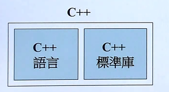
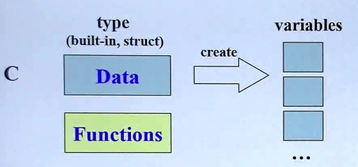
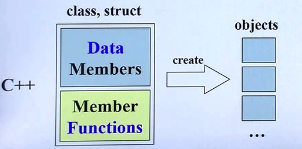
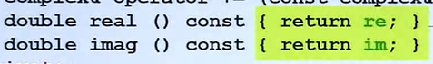
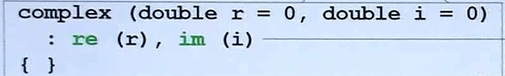
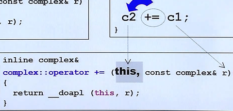
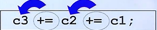
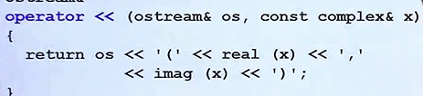
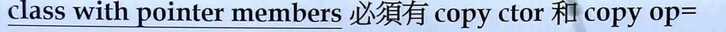
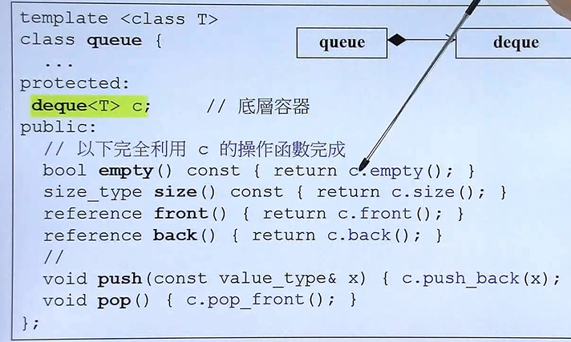

# C++面向对象编程

## C++的两种面向对象

- Object Based(基于对象)

就是这个对象和其他对象没有啥相关联的;

class有两种分类,一种是不带指针的,一种是带指针的;

- Object Oriented(面向对象)

对象之间继承,复合,委托

## C++演化

一定要摒弃98 03,C++ 11被称为C++2.0;



C++语言分为标准库和语言;本章课程只专注C++语言的设计

## C++和C的区别

在C语言中,数据和函数是没有边界的,如上图



大家是都可以去处理这些数据的;

C++把数据和处理这些处理的函数包括起来;我们就把他叫做class;

这样创建,就会变成object;



最经典的C++ Class可以分为带指针的,和不带指针的;

而带指针的就是比如string;

## C++头文件和类的声明

一般是C++的.h文件用于声明,而.cpp则是函数的实现;

事实上,我们在#include <xxx.h>就是引入别的标准库;

再有的平台上,可能出现.hpp的延申;甚至没有后面.h;

所以#include<xxx>有时候也可以;

而对于那种直接返回成员的成员函数,我们可以使用==const {return xx;}==

这样来定义Inline的函数,直接在class body完成;



 

## C++模板

首先C++模板是C++成员的某些类型不直接写死;

使用`template<typename T>`,知道你使用`complex<double> c`这个才会被绑定

# 构造函数

## 构造函数初始化列表

C++想要创建一个对象,构造函数就会自动被调用;

构造函数一定要和类的名词相同,而且没有返回值;可以有多个,参数不一样;



事实上,C++11 不必在{}中这样写,可以用构造函数的特殊语法初值列,这样就可以赋值;

## 构造函数可以有很多个

也就是可以使用C++的重载;但是不要两个构造函数出现歧义;

## 构造函数private

即外界不可以调用我的构造函数;事实上,这种就是==单例设计模式==;

也就是必须先GetInstance()获取唯一的一份,必须ClassName::getinstance().xx

## 常量成员函数

就是`double func_name() const {return mem1;}`这种写法,如果你只是要取出一个数据,成员,而不改变这个数据,一定加==const==;

## Always Reference

也就是参数传递到底是传递值(Pass by vaule)还是(Pass by reference);

到底是type arg还是type& arg?事实上,这是C++在摈弃指针;因为我们在数据的时候,为了不要过度使用堆栈,一般是传指针,而引用底层也算使用了指针;而你想传值,其实最好也传引用,加个==const==就好了,不要传值,

## 返回值传递

返回值可以是vaule,也可以是返回reference,当然,也算Alwyas Refence;

因为引用更快,同样的,如果你只是想传值,也可以在前面加const;

额外注意的是,返回值传递引用在返回的引用本体是一个==局部变量==的时候,一定不要传递!因为那一块空间已经没了;

## 友元函数

也就是前面加friend ret_type func_name(type arg);这种函数，哪怕并不是类中的成员函数,如果外界函数想要取私有的成员函数,可以让他使用;

==相同class的各个objects互为友元==,也就是我这个类可以直接拿另外类的私有成员,这样可以,因为他们是==友元==;

# 操作符重载

C++的操作符是可以定义的,这也是C++提供的特殊的功能;

## 操作符重载的成员函数重载

比如一个+=这个操作符,编译器就把他看出一个函数,而如果是成员函数的重载,当然,肯定会有this指针的,而且是谁调用这个重载符号,谁就是这个this;



所有的两元操作符都是这种形似。

而大家可以看到,如果return by reference,传递着是无需知道ref接受;

而返回引用,可以适合以下的多重相加;



## 操作符重载的非成员函数

可以使用非成员函数来定义,比如重载+

```c++
complex operator +(const complex& x,const complex& y){
	return complex(real(x)+real(y),imga(x)+imga(y));
}
```

这里需要额外注意的是,为什么不返回引用?毫无疑问,是因为引用是指针,这个时候这个类是局部变量,不能返回ret引用;这相当于是临时对象;

值得注意的是,如果你的参数有一个,那么就是==+正号==,如果想重载==-负号==,也就是一个参数;

## 位移运算的函数重载

一般把>><<位移运算,在使用cout的时候，而值得一提的是,移位这种特殊的重载函数,必须写出全局的;因为<<这种操作符第一个参数一定不是对象的this指针

他的第一个参数应该是ostream& os,第二个才是我们这个类;

然后return os<<想要重载打印的标准输出的地方;



返回的类型要是ostream& 也就是out流

# 总结

其实学下来,最收到震撼的就是,Always ref,尽量除了临时对象时候不用返回ref,其他一律用ref;如果改变就不用const;改变这个传入的值就用const即可;

还有就是重载,有成员函数承载和非成员函数重载;

非成员函数重载有点有两个

- 可以重载特殊的(==第一个参数不是this,比如<<流运算符==)

- 可以多个，比如+这个,可以重载多个;

# 拷贝构造与拷贝复制


如果是不带指针的类,有可能我们使用默认的拷贝构造和拷贝复制可能就够了;

但是一旦带指针,一定不能用编译器默认的拷贝构造函数,也就是



其实就是浅拷贝和深拷贝的区别,指针是分为浅拷贝深拷贝的,如果是浅拷贝,仅仅地拷贝指针,会出现问题;

所以一般涉及指针==这里以string==为例子如下形式

```c++
inline String::String(const String& str) {

	m_data = new char[strlen(str.m_data) + 1];
	strcpy(m_data, str.m_data);
}

String& String::operator=(const String& str)
{
	//拷贝复制
	//检测自我赋值
	if (this == &str) return *this;
	
	//先清空原来的
	delete[] m_data;
	//在复制
	m_data = new char[strlen(str.m_data) + 1];
	strcpy(m_data, str.m_data);
	return *this;
}
```

这里需要特别注意的是,拷贝复制,首先一定要检测自我赋值(==后面多态可能会有自我复制==),一但是自我赋值,直接返回即可;

## new和delete

在C++ C#都要先new个对象,而new的过程就是

先调用operator new分配一块内存,然后把这块内存(先转换成一个对象类型)进行调用ctor,通过指针来调用this;

从而完成new 一个新的对象;

而==delete==呢,其实它可以转换成两个动作,一个就是先调用==析构函数==,在调用释放内存;

实际上,这些都是用了C语言的malloc和free;

# 补充

## static

如果在类中某个变量加了static,就从对象脱离出来了,而加了static函数,同样如此;

可以理解为,所有的对象都共享一个,而static同样也是,我只能处理静态的数据了;

但是要用static成员,(如果是不同cpp和h分开写),一定要先定义;

```c++
double Account::m_rate=8.0;
```

```c++
static void set_rate(const doube& x){m_rate=x;}
```

### static 的Singleton

static 加上,可以用Singleton,配合GetInstance();,直接返回static a;

## C++ 模板

就可以用t来代表了,T就代表符号,这就是类模板

```c++
template<typename T>
class complex{
    
    T func_name() const {return x;}
    
    
}
```

而我们使用的时候,只需要

```c++
complex<double>c1(5.5,5.5);
```

## namespace

就是可以把函数类包装在一个单元,比如标准库所有的函数都在std里面,

我们可以用`using namespace std;`来直接的使用;从此不再写全名;

当前也可以`using std::cout`,这样可以一条一条的;

或者`std::cin`,这样比较麻烦;

# 总结

总之,这上面一些就是另一个类的涉及,那就是涉及指针的类涉及,不得不说C++真的非常有逻辑而且优美,虽然C#比他简洁,但是C++代码真的很漂亮;

值得注意的就是以后多用new 来申请对象,这一点和C#接轨,这样以后写C#多了就不会不适应了;

还有就是==delete==如果你申请的是数组,记得delete []加个这玩意,new的时候申请数组是new type[count];

还有就是深浅拷贝的问题,涉及到指针的类,一般不重载拷贝构造和拷贝赋值是默认浅拷贝的,也就是把指针也给赋值过去,那样会发生问题;所以记得重载;

现在我们已经学完了object-based,也就是基于对象的涉及,接下来应该考虑OOP,也就是面向对象的涉及了;

# 组合与继承

## 组合

就是我里头有另一个东西,就是has-a,一个对象里面有另一个对象;

一个类有另一个类;比如



比如,上面就是所有的功能都在deque完成了,queue直接借用他的功能;

而在上面的表项出来就是deque比你的queue的强大,那么我直接通过组合,有一个底层容器,这就是一种设计模式,叫做==Adapter==,就是相当于我改装以下;这个queue就是Adapter,但是并不是所有的复合都是Adapter;

### 组合的构造和析构

涉及组合的时候,构造的时候,外部的Container,先调用Component的默认构造,在执行自己的构造函数;

可以理解为由内向外的构造;

而析构的时候,则是由外向内,先调用外部的Container,在调用Component;

## 继承

```c++
class a:public b{
    
    xxx;
    
}
```

这就是属于基础,继承有三种继承,private,以及protected继承;

同样的,和==组合相反==,构造函数是先调用父类,在调用子类;

析构则是先调用子类的析构,在调用父类的析构;

另外,继承的基类析构函数必须是virtual的,否则会异常;


## Delegation委托

就是有一个类,他类里面指向另一个类的;也就是存放的指针;

Delegation,其实还有个名字叫做Composition by reference;

比如下面的这种代理

```c++
class String{
    
    public:
    String();
    String(const char* s);
    String(const String& s);
    private:
    StringRep* rep;
};
class StringRep{
    
  //some delegation function  
    
};

```

也就是说我的真正为我所有实现功能的类,在我的String被指向;

这是一个很==有名的设计方式==,这样里面实现可以改变,对外的接口是不变的;这具有一种弹性;

# 虚函数和多态

## 虚函数

复合委托继承都是OOP的相关概念;而虚函数和多态一般是用于继承的OOP的;

当我们使用OOP的继承的时候,最好使用虚函数,虚函数就是virtual加个;

在继承的时候,数据可以被继承,函数也可以被继承;

函数的继承有不同情况,比如

non-virtual,你不希望虚函数不被(override-覆写);

virtual,可以希望子类定义,但是不定义也有默认的；

pure virtual,纯虚函数,子类一定要去定义;

比如我定义一个shape的类,定义如下的函数

```c++
class Shape{
    virtual void draw() const=0;//纯虚函数 子类必须重新定义,有这个的类也被叫做
  	virtual void err(const std::string& msg);//涉及虚函数,但是子类可以覆写
    int object_id() const{return id;};
};
```

==和C#的虚函数唯一区别就是,C#在覆写的时候必须加`override`关键字==

# 转换函数

这里说的转换是值对象类之间的转换;

其实可以使用重载操作来进行转换

- 把类转换成其他类型

`operator double() const{return （double）(a/b);}`用于这种来进行转换函数;

值得一提的是,转换函数并没有返回值类型;

同样地,类的转换函数也有很多；**而且所有的转换函数都可以隐式地转换**

比如上面的,默认的double转换,那么下面的代码

`double df=4.0+Obj(5,6);`它可以默认地转换,当然,他就还可能去找有没有重载operator +;

# Pointer-like classes

这个类像一个指针,也被称为`智能指针`;C++11之后有很多智能指针,

它里面一定是有一个真正的指针,他用了泛型;

也就是说,指针有的功能他必须都得有,比如


比如指针最基本的解引用，->运算符;值得注意的是,重载的operator是直接返回指针;

这是因为C++中,->符号是特殊的,不会==消失==;会继续作用下去;

## 基于pointer-like的迭代器

迭代器本质上就是`一种智能指针`,但是有些许区别;

但是他要处理的更多,他要处理++,--这些操作符;

`slef operator++(){self tmp=*this;++*this;return tmp;}`来实现迭代器的++;

但是迭代器和指针只能的==解引用和->运算符==都大相径庭;

> 本质上,迭代器就是一个`链表`,然后运用`泛型`来进行把一个容器的所有元素放入迭代器;
>
> 这样导致迭代器和解引用以及->运算符都不同;
>
> 因为假设迭代器的主要结构是一个双向链表,那么实际上他解引用,运算
>
> 都应该操作DATA,而不是pre 和 next;

# Function-like classes

也就是所谓的仿函数,一个像函数的class;

其实本质上,一个函数就是一个()重载符号而已;

```c++
template <class T>
struct identity{
    const T& operator() (const T& x) const{return x;}
    
}
```

这样就可以达到仿函数的目的;

这就是类的两个相似,一种类是像指针,还有一种类是像函数;

像指针可以像`智能指针`和`迭代器`

而像函数则是重载operator() (args)来进行仿函数的涉及;

### Namespace的经验之谈

其实Namespace就是用于限定,把函数包起来;防止函数命名冲突；

侯捷建议`任何函数都用namespace包起来`;

# template和泛型

## 类模板

即在涉及class的时候,如果觉得某些类型可以由使用者任意定义,可以使用模板

```C++
template<class T>
class complex{
    
    private:
    T real;
    T image;
}
```

## 函数模板

`const T& min(const T& a,const t& b){//def}`这样即可使用函数模板;

## 成员模板8T


 就是在模板里面,又有模板;也就是外边的T1 T2被确定,里面的U1 U2也可以被确定;

一般成员模板多用于==构造函数==;


## 模板特化

也就是泛化的反面,也就是面对独特的类型来进行特殊的处理;

特化在实现的时候是这样实现的

```C++
template<>//什么都不加
struct hash<int>{
    
    //特化的内容函数
    
}
```

## 模板偏特化

- 个数上的偏特化

```c++
template <typename T1,typename T2>
class vector{
    
    ...
};
template vector<bool,T2>{
    
    //特化处理
}
```

即有点像模板特化,但是模板参数有多个;

- 范围上的偏特化

规定泛型范围,比如使用指针,和不使用指针;

```C++
template <typename T>
class C{
    
    
}
//特化版本
template <typename T>
class C<T*>{
    
    
}
```

假如版本使用的是指针,T可以随便用,U*也行;

使用者`C<string> c1`和`C<string*> c2`是完全不一样的'

## 数量不定的模板参数

也就是模板的参数是可变的;

```c++
template <typename T,typename... Types>
void print(const T& firstArg,const Types&... args){
    
    cout<<firstArg<<endl;
    print(args...);//递归
}
```


# 引用

所谓引用,本质上就是指针;

他就代表引用的参数;但是他和指针又有区别;

比如下面的代码**一旦引用,就不能代表其他任何变量**

```c++
int x=5;
int& r=x;//代表
int x2=6;
r=x2;
```

这里x,和x2都变成6了,r就是代表,可以理解为`x=x2`;

引用很少用于申明变量,一般用于==传参==;或者是返回;

# 复合和继承的ctor的dtor

- **继承**

在继承的时候,是首先调用Base的==默认构造==,在调用派生类的构造函数

而在析构的时候,先执行派生类的析构,再去执行Base的析构;

- **复合**

复合的时候,被拥有者的ctor先加载;

而析构的时候,Container先析构

其实无论是继承还是复合,都是构造==由内而外==,析构都是==由外而内==

- **继承+复合**

构造时候,先执行Base,在执行Component,最后执行自身;

而析构相反;

# 虚指针和虚表

只要类中带有虚函数,那么在类最前面就有一个指针,

这个就是虚指针;虚函数和虚指针就是CPP实现多态的最终原因;

只要实例化类之后,该对象的地址一个内容一定是一个指针,这个指针指向虚函数;


每个类都不一样;如果这个类继承了,没有的话,虚表指向的内容是相同的,否则,则是不相同;

# New Delete的重载

在之前,new delete的操作是

new是先分配内存,在执行构造函数

而delete则是先析构函数,再去指向释放内存;

重载new/delete进行如下重载

```C++
inline void* operator new(size_t size){
    
    cout<<"new test"<<endl;
    return myAlloc(size);
}

inline void* operator new[](size_t size){
    
    cout<<"new [] test"<<endl;
    return myAlloc(size);
}
inline void operator delete(void* ptr){
    
    cout<<"delete"<<endl;
    myFree(ptr);
}

```

`new`重载的时候必须加上参数`size_t`,这个size是编译器给你的;

而且,在class内部声明重载new的时候,记得加`static`

而一般

```c++
void* myAlloc(size_t size){
    
    return malloc(size);
}
void myFree(void* ptr){
    
    return free(ptr);
}
```


