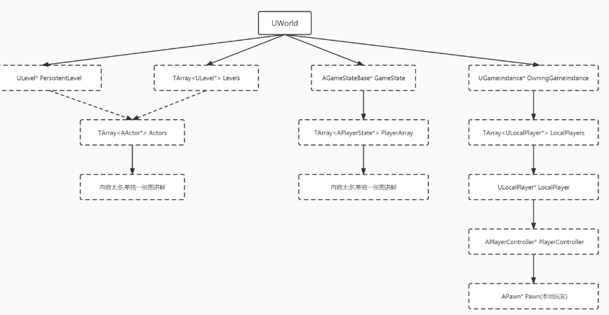
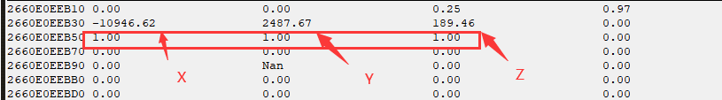
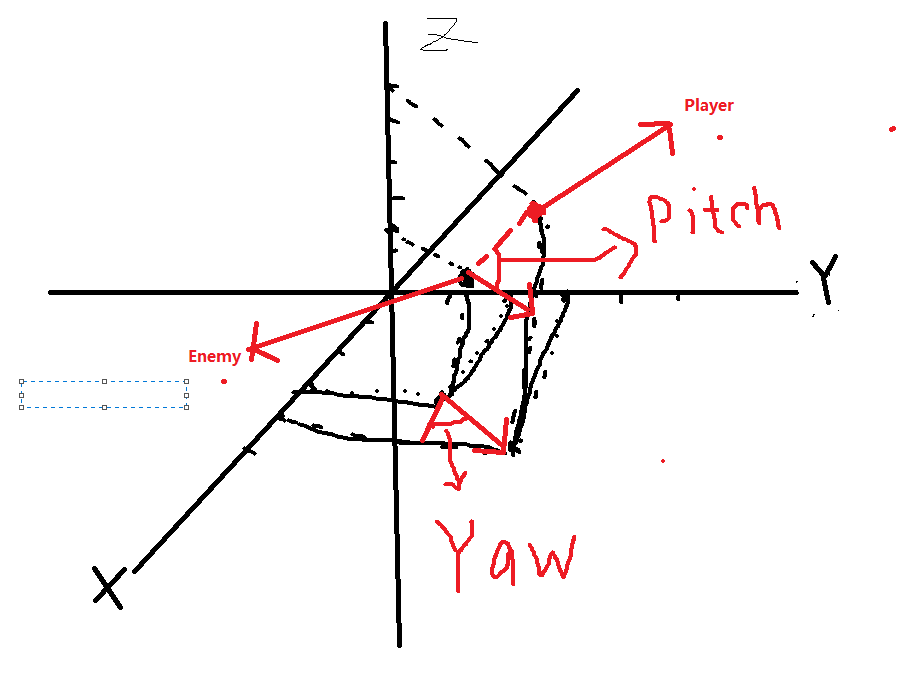

# 0x1 UE5引擎Polygon逆向

经过前面UE4引擎基础知识,UE引擎逆向的核心是:

> **GName当作类名过滤东西,GWorld包含万物,地图物品数组,人物状态,联网的人物数组,本人物的Pawn,当前关卡等**
>
> **其他重要的结构体,就是AActor这个类,他是一切物品的基类,他保存着物品的状态信息,坐标**

总之一张图概况就是



总之可以这样说,*找到GWorld*,就找到了万物。

## 0x1-1 GWorld中常用的成员含义

- **UGameInstance 世界实例**

  1. 找到**PlayerController**,再UGameInstance里面,根据SDK查找到,是`WorldToScreen`的函数的This指针。
  2. 找到APawn,也就是本地人物的对象,这对于摄像机,障碍判断有作用。

- **ULevel* PersistentLevel;当前关卡**

  		1. 当前关卡中有一个TARRY数组,这个是保存着当前关卡的所有物品的TARRY,很多,SDK没有Dump,常用寻找方法是依靠TARRY的特征。
  	2. 通过GName(uObject+0x18的运算找到NamePrivate,根据UEName的运算)过滤物品。

- **AGameStateBase* GameState;**

    1. 这是游戏状态,里面保存了一个TARRY,叫做`TArray<APlayerState*>     PlayerArray;`

       这个APlayerState某个位置保存指向ACtor,也就是人物对象,这是联网游戏所特有的,联网游戏会把玩家数组放在这个位置,使用它可以免GName的过滤之嫌。

       - **APlayerState**

         这是一个重要的结构体,对于FPS游戏,里面有很多人物状态数据

         ```c++
         class APlayerState {
         
         public:
         	char _padding01[0x2f0];
         	class AActor* PawnPrivate;//2f8
         	char _padding02[0x108];
         	char Team; //0x400
         	char _padding[0x17];    //401
         	UInventoryComponent_Game* InventoryComponent;  // 0x0418(0x0008)
         };
         
         ```

我们可以在 `UGameInstance* OwningGameInstance;`这个地方找到两个比较有用的,分别是ScreenToWorld这个函数的This指针,也就是**PlayerController**,还能找到当前人物的**APawn**。

### 0x1-1-1 PlayerController以及本地玩家APawn的获取

```c++
ULONG_PTR UGameInstance::GetPlayerController()
{

	ULONG_PTR* Data = *(ULONG_PTR**)(this + 0x38);//TArrt数组

	ULONG_PTR pUPlayer = *Data;//在ULocalPlayer*的TArry里面 一般是第一个有用

	return *(PULONG_PTR)(pUPlayer + 0x30);

}

ULONG_PTR UGameInstance::GetPawn()
{
	//获取人物控制器 本地玩家在这个里面
	ULONG_PTR PlayerController = GetPlayerController();

	//死寂
	//APawn*   Pawn;  // 0x0250(0x0008) 本地玩家在PlayerController的0x250

	//polygon
	//APawn* Pawn;        // 0x02B8(0x0008)

	return *(PULONG_PTR)(PlayerController+0x2B8);
}

```

以上均是再SDK中找到的,需要根据SDK的偏移查找。

## 0x1-2 绘制(ESP)

想要绘制首先最重要的便是`WorldToScreen()`,这个函数可以把随处可以获得的世界坐标转换成屏幕坐标。

### 0x1-2-1 WorldToScreen

```c++
bool UGameplayStatics::ProjectWorldToScreen(APlayerController* Player,FVector WorldPosition,FVector2D& ScreenPosition,bool bPlayerViewportRelative);
```

这个我们可以从SDK获取。第一个是参数This指针,也就是之前UWorld的==WorldInstance==获取的。

### 0x1-2-2 骨骼的寻找

依旧是调用SDK,我们需要调用GetBoneMatrix这个函数,但是SDK是Dump不出来的。一般思路是找这个函数的SDK

```C++
void USkinnedMeshComponent::TransformFromBoneSpace(FName BoneName,FVector InPosition,FRotator InRotation,FVector OutPosition,FRotator OutRotation);
```

因为这个函数调用了GetBoneMatrix,一般特征是这个[^特征由来]

```c++
LODWORD(v11) = sub_140D03210(v12 + 640, &v26);
      if ( (_DWORD)v11 != -1 )                  // 带-1 并且传This指针的就是GetBoneMatrix
      {
          xxxx;
        GetBoneMatrix(This, &v46, v11);
          xxxx;
      }
```

- GetBoneMatrxi的定义是

```c++
typedef FMatrix* (*fnGetBoneMatrix)(PVOID This, FMatrix* OutMatrix, uint32_t BoneIndex);
```

**其中This指针是Mesh,返回值是一个4*4矩阵 4行1 2 3 列便是世界坐标**.

**BoneIndex便是骨骼索引,**这个确认需要通过**Mesh找过骨骼矩阵**,来确定数量

- Mesh在哪

​	毫无疑问,Mesh肯定是在人物Actors对象里面,

```c++
struct AActor {
	char _padding[0x190];

	USceneComponent* RootComponent; //0x130


	char _padding_03[0x100];//

	class APlayerState* PlayerState;//这是APlayerState 可以在这个地方找到 


	char _padding_04[0x58];


	USkeletalMeshComponent* Mesh;// 0x02F8(0x0008) 这个就是Mesh,也就是调用GetBoneMatrix的This指针


};
```

在Actor结构中,找到USkeletalMeshComponent,他的结构一般是 

```c++
struct USkeletalMeshComponent : public USceneComponent {


	char _pading[0x280];

	USkeletalMesh* SkeletalMesh; //0x470 骨骼名在这个地方

	char _pading01[0x128];

	TArray<FTransForm> SkeletMatrix[2]; //骨骼矩阵  0x5a0
										//4b0 还有一个矩阵 其实是一个TARRY []

	
};
```

我们凭借==TArray<FTransForm> SkeletMatrix[2];==的TARRY特征即可找到骨骼数组。骨骼数组是一个矩阵,通过特殊方式计算出世界坐标。

**FTransForm就是一个4*3矩阵**

### 0x1-2-3 人物世界坐标寻找

**所有坐标基本都是无法sdk dump到**,只能自己根据特征找,坐标矩阵的特征一般是

3x4或者4x3矩阵,有浮点  以及 1 1 1这种如下图



3*4矩阵,而且最后是1 1 1

人物世界坐标位于[Actor]()的这个地方

```C++
USceneComponent*                              RootComponent; 
```

SDK找到偏移,我们就只能根据特征找了

### 0x1-2-4 方框的编写

方框是FPS逆向中必不可少的部分。方框分为2D和3D方框

#### 0x1-2-4-1 2D方框编写

对于2D方框的编写,我们需要找两个点,分别是人物的左上角和右下角的坐标。

然后把这两个点分别当作两条射线的起点,交的四个点就可以画框了。

我们判断这些最低点最高点的方法可以用骨骼的坐标进行判断。

然后直接调用`ImGui::GetForegourdDrawList()->AddRect()`进行画框。

我们首先根据骨骼点找到人物骨骼最左,最右,最上,最下的点

```C++
void Render::DrawBox2D(ImColor color)
{
	int Left = FindLeftIndex();
	int Low = FindLowIndex();
	int High = FindHighIndex();
	int Right = FindRightIndex();

	if (BoneIs[Left] && BoneIs[Right] && BoneIs[Low] && BoneIs[High]) {
		//骨骼点都在屏幕内 则画
		ImGui::GetForegroundDrawList()->AddRect(ImVec2{BonePoint[Left].x,BonePoint[High].y}, ImVec2{BonePoint[Right].x,BonePoint[Low].y}, color);
	}

}
```

然后直接调用Imgui自带的AddRect画框即可。

### 0x1-2-5 2D旋转雷达的编写

这个需要找到**摄像机和玩家的朝向**,因为我们要看SDK

在Apawn中的

```c++
AController*                                  Controller;                       // 0x02B0(0x0008)
```

这是一个指向子类的父类指针

在APlayerController里面,也就是在

```c++
  APlayerCameraManager*                         PlayerCameraManager;         // 0x0330(0x0008)
```

找到相机管理器,找到相机,0x10的偏移就是一个FVector

```c
FCameraCacheEntry                             CameraCachePrivate;           // 0x2220(0x07B0)
```

其实就是把偏移加0x10,修复结构如下:

```c++
class APlayerCameraManager {
public:
	char _padding[0x2230]; //0x2220+0x10
	FVector                Location;      // 0x0010(0x05E0) 相机坐标
```

接下来我们就是找到玩家朝向了,玩家朝向的结构体一般是APG_Character

这个是继承的`ACharacter`结构体的,

```c++
class APG_Character : public ACharacter
```

我们可以根据这两个成员找到朝向

```C++
float                                         ControllerPitchRotation;        // 0x063C(0x0004)
float                                         ControllerYawRotation;          // 0x0640(0x0004)
```

继续修复Actor结构体即可。

为了绘制雷达,我们需要获取游戏的高度和宽度,

### 0x1-2-6 射线绘制


射线的绘制非常简单,也是用到了骨骼的坐标,我们只需要找到准星位置正下方刚好和游戏相交的位置即可。

准星位置就是直接GetClientRect获取宽高坐标，除2即可。

```c++
void Render::DrawSnapLine(ImColor Color) {

	if (BoneIs[BoneFNames::Root]) {
		//判断开始的点是否在屏幕内

		//找到准星的位置,直接连线
		ImGui::GetForegroundDrawList()->AddLine({ g_Width, g_Height * 2 }, {BonePoint[BoneFNames::Root].x,BonePoint[BoneFNames::Root].y}, Color);

	}


}
```

### 0x1-2-7 血量的寻找与绘制

在UE引擎中,血量的组件位于APG_Character中

我们可以找一下:

```c++
class APG_Character : public ACharacter

{
UHealthStatsComponent*                        HealthStatsComponent;          // 0x0710(0x0008)
UWeaponComponent*                             WeaponComponent;               // 0x0718(0x0008)
}

```

而`UHealthStatsComponent`这个类是这样的:

```c++
class UHealthStatsComponent : public UActorComponent
{
    FMulticastInlineDelegate                      OnChangeHealth;                                               // 0x00B0(0x0010)
    FMulticastInlineDelegate                      OnHealthProtection;                                           // 0x00C0(0x0010)
    FMulticastInlineDelegate                      OnIsAlive;                                                    // 0x00D0(0x0010)
    char                                          Health;                                                       // 0x00E0(0x0001)
    bool                                          bIsAlive;                                                     // 0x00E1(0x0001)
    bool                                          bHealthProtection;                                            // 0x00E2(0x0001)
    char                                          pa_00E3[0x0001];                                              // 0x00E3(0x0001)
    float                                         LastTimeTakeDamage;                                           // 0x00E4(0x0004)
    float                                         Stamina;                                                      // 0x00E8(0x0004)
    char                                          pa_00EC[0x0004];                                              // 0x00EC(0x0004)
    TArray<FPlayerAssist>                         KillAssists;                                                  // 0x00F0(0x0010)
    char                                          pa_0100[0x0020];                                              // 0x0100(0x0020)
};
```

我们可以找到是否或者,血量,以及是否是保护等等。可以通过这个进行过滤

我们绘制血量的思路其实很简单,就是找==在哪绘制==,然后==绘制矩形==,==填充颜色==即可。

在哪绘制,我们找到人物骨骼坐标的最左边,最上面,最下面,就可以画矩形了,填充矩形也就是ImGui的函数。最后实现如下:

```c++
void Render::DrawBlood(ImColor Color) {

	int Left = FindLeftIndex();
	int Low = FindLowIndex();
	int High = FindHighIndex();

	if (BoneIs[Left] && BoneIs[Low] && BoneIs[High]) {
		//这三个点在屏幕内

		if (Actor->HealthStatsComponent->Health < 50) {
			//如果血少 表明以下
			Color = ImColor{ 255,0,0 };
		}

		float fFilled = ((float)(Actor->HealthStatsComponent->Health) / 100.f)*(BonePoint[High].y- BonePoint[Low].x);

		//绘制一个矩形 然后填充
		ImGui::GetForegroundDrawList()->AddRect({ BonePoint[Left].x - 5,BonePoint[High].y }, { BonePoint[Left].x - 2,BonePoint[Low].y }, Color);
		ImGui::GetForegroundDrawList()->AddRectFilled({ BonePoint[Left].x - 4,BonePoint[High].y }, { BonePoint[Left].x - 3,BonePoint[Low].y }, Color, fFilled);


	}

}
```

### 0x1-2-8 障碍判断

通过前面的逆向我们指定,UE障碍判断其实是通过LineTraceSingle这个函数进行判断的

```c++
bool UKismetSystemLibrary::LineTraceSingle(UObject* GWorld,FVector Start,FVector End,enum class ETraceTypeQuery TraceChannel,bool bTraceComplex,TArray<AActor*> ActorsToIgnore,enum class EDrawDebugTrace DrawDebugType,FHitResult OutHit,bool bIgnoreSelf,FLinearColor TraceColor,FLinearColor TraceHitColor,float DrawTime);
```

这个函数参数很多,我们可以通过返回值来确定是否有障碍。

- Start和End:顾名思义,这个就是世界坐标,通常是人物摄像机坐标是Start,而End这是目标的世界坐标
- ActorsToIgnore:一个是自身的Actors,一个是敌人的Actors

```c++
bool LineTraceSingle(FVector Start, FVector End, AActor* Actor)
{
	bool ret(false);

	auto Pawn = (AActor*)(*(UWorld**)GWorld)->OwningGameInstance->GetPawn();

	TArray<AActor*> tActors;

	tActors.Data = new AActor* [2];

	tActors.Data[0] = Pawn;

	tActors.Data[1] = Actor;

	tActors.Count = 2;

	tActors.Max = 2;

	FHitResult Hit{0};
	FLinearColor color{0};

	ret=LineTraceSingle_(GetWorld(), Start, End, 0, true, tActors, 0, Hit, 1, color, color, 0);

	return ret;
}
```

我们只需要这样调用即可。

## 0x1-3 自瞄

在UE引擎中,自瞄分为内存自瞄和静默自瞄,子弹追踪也属于自瞄范畴,魔术子弹也是,但是魔术子弹的子弹可以穿墙。

### 0x1-3-1内存自瞄的实现

所谓的内存自瞄其实就是修改准星的位置,修改到指定位置。

而另一种则是修改人物的朝向,刚好到敌人，算法是固定的。

更改人物朝向与更改人物准星,本质上是一样的。

UE引擎中,描述人物旋转角度的位于

```c++
struct AActor {
	char _padding[0x190];

	USceneComponent* RootComponent; //190


	char _padding_03[0x100];//298

	class APlayerState* PlayerState;//这是APlayerState 可以在这个地方找到 0x298

	char padding_04[0x10];  //2a0

	AController* Controller;//2b0

	char _padding_05[0x40];

	USkeletalMeshComponent* Mesh;// 0x02F8(0x0008)

	char _padding_06[0x33c];//0x300

	float        ControllerPitchRotation;                   // 0x063C(0x0004)
	float        ControllerYawRotation;                 // 0x0640(0x0004)

	char padding_07[0xcc];

	UHealthStatsComponent* HealthStatsComponent;
};
```

即ControllerPitchRotation和ControllerYawRotation,通过计算出摄像机和敌人直接X-Y平面的角度差值(==即ControllerYawRotation==),以及摄像机和敌人以X-Y为基准,Z轴角度的差值,得出仰角。然后修改人物的上述角度,从而使摄像机正对敌人,也就是人物准星正对敌人。实现自瞄。

角度的计算:



计算这两个角度需要用

atant计算,注意,他计算的是弧度,需要*180/Π转换成角度。

```c++
	FVector diff{ EnemyPos.x - CameraPos.x,
			  EnemyPos.y - CameraPos.y,
			  EnemyPos.z - CameraPos.z,
	};

	FRotator AimRotation{ 0 };

	AimRotation.Yaw = atan2(diff.y, diff.x) * 180 / 3.1415926;
	AimRotation.Pitch = atan2(diff.z, sqrt(diff.x * diff.x + diff.y * diff.y)) * 180 / 3.1415926;
```

计算之后,直接修改人物朝向,即可实现自瞄

```c++
LocalPlayer->ControllerYawRotation = (float)AimRota.Yaw;
LocalPlayer->ControllerPitchRotation = (float)AimRota.Pitch;
```

###  0x1-3-2 静默自瞄与子弹追踪

#### 0x1-3-2-1 查找射击Call

UE引擎中,射击Call的关键词是Spawn(**发射**)或者(**Fire**)开火

```c++
/ Function  POLYGON.TraceProjectile.Spawn
// Offset::0x22B4AE0;
void ATraceProjectile::Spawn(ATraceProjectile* bulletClass,AItem_Weapon_General* weapon,FVector SpawnLocation,FVector startVelocity,char RandomSeed);
```

这是Polygon的射击Call

他第一个参数是子弹类,第二个参数是AItem_Weapon_General武器类型。

第一个参数在武器类中有,在武器类的

```c++
ATraceProjectile*                             ProjectileClass;   // 0x0368(0x0008)
```

是一样的类。

在玩家状态里面是有这个的。

```c++
class APlayerState {

public:
	char _padding01[0x2f0];
	class AActor* PawnPrivate;//2f8
	char _padding02[0x108];
	char Team; //0x400
	char _padding[0x17];    //401
	UInventoryComponent_Game* InventoryComponent;  // 0x0418(0x0008)
};
```

即InventoryComponent这个组件中有一堆AItem_Weapon_General,其中有一个当前武器,就是玩家正在使用的。

思路是Hook这个武器射击Call,修改他的参数。就可以实现静默自瞄。

SpawnLocation 射出的坐标

startVelocity是指子弹的朝向,Hook这个函数需要改变这两个。

获取子弹朝向可以使用GetForwardVector进行获取。

```c++
FVector UKismetMathLibrary::GetForwardVector(FRotator InRot);
```

通过这个函数可以返回朝向向量。InRot是直接内存自瞄的角度偏差

#### 0x1-3-2-2 静默自瞄

静默自瞄是指准星没有移动到敌人身上,也会杀死敌人。

实现原理是修改射击Call子弹朝向为敌人朝向。和自瞄效果类似

#### 0x1-3-2-3 子弹追踪

子弹追踪是修改子弹射出的坐标为人物头部,无视距离和掩体。

也是需要Hook射击Call

### 0x1-3-3 Hook子弹Call实现方式

用Int3方式断点Hook,然后VEH接管，直接进行修改ExContext中的R8即可实现子弹追踪,代码如下

```c++
LONG  Handler(PEXCEPTION_POINTERS ExceptionInfo)
{
	if (ExceptionInfo->ExceptionRecord->ExceptionAddress == Spawn_Int3.GetHookAddr())
	{
		Spawn_Int3.UnHook();

		Spawn_Int3.HookJmpAddr();

		FVector* SpawnLocation = (FVector*)(ExceptionInfo->ContextRecord->R8);
		FVector* startVelocity = (FVector*)(ExceptionInfo->ContextRecord->R9);
	
		if (AimBot::GetInstance()->IsCanAim())
		{
			if (AimBot::GetInstance()->GetEnemy()->Mesh) {
				*SpawnLocation = GetBoneLocation(AimBot::GetInstance()->GetEnemy()->Mesh, BoneFNames::Head);
			}
			
			
		}

		return EXCEPTION_CONTINUE_EXECUTION;
	}
	else if (ExceptionInfo->ExceptionRecord->ExceptionAddress == Spawn_Int3.GetJmpAddr())
	{
		Spawn_Int3.Hook();
		Spawn_Int3.UnHookJmpAddr();
		return EXCEPTION_CONTINUE_EXECUTION;
	}

	return EXCEPTION_CONTINUE_SEARCH;
}
```

## 0x1-4杂项功能的实现

实现起来都是很简单,都是找武器的一些类的成员,chatgpt可以快速分析

### 0x1-4-1武器无后座


```c#
if (g_Settings.weapon_no_diff) {
			Weapon->AccuracyHip = 99999.f;
			Weapon->AccuracySight = 99999.f;
			 Weapon->SpreadShot = 0.f;
			 Pawn->HealthStatsComponent->bHealthProtection = TRUE;
		}
```

```c++
if (g_Settings.weapon_no_recoil) {
			Weapon->WeaponUpRecoil = 0.f;
			Weapon->WeaponRecoilLift = 0.f;
			Weapon->WeaponBackwardRecoil = 0.f;
			Weapon->WeaponRecoilAlphaPerShot = 0.f;

		}
```

### 0x1-4-2 人物无限精力

```c++
if (g_Settings.inf_stamina) {

			Pawn->HealthStatsComponent->Stamina = 100.f;
		}
```


### 0x1-4-3 武器射击时间

```C
		if (g_Settings.weapon_shot_time) {
			Weapon->TimeBetweenShots = 0.00001f;

		}
```


### 0x1-4-4 武器子弹数目


```c++
if (g_Settings.weapon_inf_bullets) {

			Weapon->MaxMagazineAmmo = 9999;
			
			

		}
```


---


[^特征由来]:UE引擎源码中有
