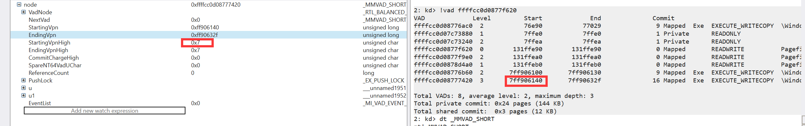
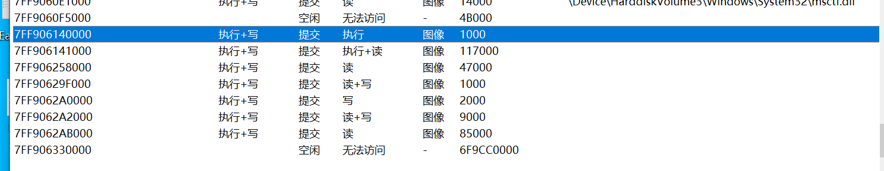

# 前言

blackbone作为windows一个开源的黑客工具库,代码量巨大,这里只进行阅读`blackbone`的驱动代码;罗列出主要逻辑和一些知识点;

# 初始化

在DriverEntry中,BlackBone巧妙地使用了windows导出但是没有文档化的内核函数`KeCapturePersistentThreadState`来获取一系列信息;

## 一键获取windows所有全局变量和偏移

这个函数非常非常强大,其实他主要是**用处是当发生蓝屏的时候用于保存DUMP文件**,借此因为可以通过调用这个函数来进行获取一系列内核未导出的符号;

函数使用方法如下:

```C++
VOID InitializeDebuggerBlock()
{
    CONTEXT context = { 0 };
    context.ContextFlags = CONTEXT_FULL;
    RtlCaptureContext( &context );
    
    PDUMP_HEADER dumpHeader = ExAllocatePoolWithTag( NonPagedPool, DUMP_BLOCK_SIZE, BB_POOL_TAG );
    if (dumpHeader)
    {
        KeCapturePersistentThreadState( &context, NULL, 0, 0, 0, 0, 0, dumpHeader );
        //RtlCopyMemory( &g_KdBlock, (PUCHAR)dumpHeader + KDDEBUGGER_DATA_OFFSET, sizeof( g_KdBlock ) );

        ExFreePool( dumpHeader );
    }
}
```

其中dumpHeader是一个`PDUMP_HEADER`的结构,这个结构里面有非常多的有大用处的结构体

```C++
typedef struct _KDDEBUGGER_DATA64 {

    DBGKD_DEBUG_DATA_HEADER64 Header;

    //
    // Base address of kernel image
    //

    ULONG64   KernBase;

    //
    // DbgBreakPointWithStatus is a function which takes an argument
    // and hits a breakpoint.  This field contains the address of the
    // breakpoint instruction.  When the debugger sees a breakpoint
    // at this address, it may retrieve the argument from the first
    // argument register, or on x86 the eax register.
    //

    ULONG64   BreakpointWithStatus;       // address of breakpoint

    //
    // Address of the saved context record during a bugcheck
    //
    // N.B. This is an automatic in KeBugcheckEx's frame, and
    // is only valid after a bugcheck.
    //

    ULONG64   SavedContext;

    //
    // help for walking stacks with user callbacks:
    //

    //
    // The address of the thread structure is provided in the
    // WAIT_STATE_CHANGE packet.  This is the offset from the base of
    // the thread structure to the pointer to the kernel stack frame
    // for the currently active usermode callback.
    //

    USHORT  ThCallbackStack;            // offset in thread data

    //
    // these values are offsets into that frame:
    //

    USHORT  NextCallback;               // saved pointer to next callback frame
    USHORT  FramePointer;               // saved frame pointer

    //
    // pad to a quad boundary
    //
    USHORT  PaeEnabled;

    //
    // Address of the kernel callout routine.
    //

    ULONG64   KiCallUserMode;             // kernel routine

    //
    // Address of the usermode entry point for callbacks.
    //

    ULONG64   KeUserCallbackDispatcher;   // address in ntdll


    //
    // Addresses of various kernel data structures and lists
    // that are of interest to the kernel debugger.
    //

    ULONG64   PsLoadedModuleList;
    ULONG64   PsActiveProcessHead;
    ULONG64   PspCidTable;

    ULONG64   ExpSystemResourcesList;
    ULONG64   ExpPagedPoolDescriptor;
    ULONG64   ExpNumberOfPagedPools;

    ULONG64   KeTimeIncrement;
    ULONG64   KeBugCheckCallbackListHead;
    ULONG64   KiBugcheckData;

    ULONG64   IopErrorLogListHead;

    ULONG64   ObpRootDirectoryObject;
    ULONG64   ObpTypeObjectType;

    ULONG64   MmSystemCacheStart;
    ULONG64   MmSystemCacheEnd;
    ULONG64   MmSystemCacheWs;

    ULONG64   MmPfnDatabase;
    ULONG64   MmSystemPtesStart;
    ULONG64   MmSystemPtesEnd;
    ULONG64   MmSubsectionBase;
    ULONG64   MmNumberOfPagingFiles;

    ULONG64   MmLowestPhysicalPage;
    ULONG64   MmHighestPhysicalPage;
    ULONG64   MmNumberOfPhysicalPages;

    ULONG64   MmMaximumNonPagedPoolInBytes;
    ULONG64   MmNonPagedSystemStart;
    ULONG64   MmNonPagedPoolStart;
    ULONG64   MmNonPagedPoolEnd;

    ULONG64   MmPagedPoolStart;
    ULONG64   MmPagedPoolEnd;
    ULONG64   MmPagedPoolInformation;
    ULONG64   MmPageSize;

    ULONG64   MmSizeOfPagedPoolInBytes;

    ULONG64   MmTotalCommitLimit;
    ULONG64   MmTotalCommittedPages;
    ULONG64   MmSharedCommit;
    ULONG64   MmDriverCommit;
    ULONG64   MmProcessCommit;
    ULONG64   MmPagedPoolCommit;
    ULONG64   MmExtendedCommit;

    ULONG64   MmZeroedPageListHead;
    ULONG64   MmFreePageListHead;
    ULONG64   MmStandbyPageListHead;
    ULONG64   MmModifiedPageListHead;
    ULONG64   MmModifiedNoWritePageListHead;
    ULONG64   MmAvailablePages;
    ULONG64   MmResidentAvailablePages;

    ULONG64   PoolTrackTable;
    ULONG64   NonPagedPoolDescriptor;

    ULONG64   MmHighestUserAddress;
    ULONG64   MmSystemRangeStart;
    ULONG64   MmUserProbeAddress;

    ULONG64   KdPrintCircularBuffer;
    ULONG64   KdPrintCircularBufferEnd;
    ULONG64   KdPrintWritePointer;
    ULONG64   KdPrintRolloverCount;

    ULONG64   MmLoadedUserImageList;

    // NT 5.1 Addition

    ULONG64   NtBuildLab;
    ULONG64   KiNormalSystemCall;

    // NT 5.0 hotfix addition

    ULONG64   KiProcessorBlock;
    ULONG64   MmUnloadedDrivers;
    ULONG64   MmLastUnloadedDriver;
    ULONG64   MmTriageActionTaken;
    ULONG64   MmSpecialPoolTag;
    ULONG64   KernelVerifier;
    ULONG64   MmVerifierData;
    ULONG64   MmAllocatedNonPagedPool;
    ULONG64   MmPeakCommitment;
    ULONG64   MmTotalCommitLimitMaximum;
    ULONG64   CmNtCSDVersion;

    // NT 5.1 Addition

    ULONG64   MmPhysicalMemoryBlock;
    ULONG64   MmSessionBase;
    ULONG64   MmSessionSize;
    ULONG64   MmSystemParentTablePage;

    // Server 2003 addition

    ULONG64   MmVirtualTranslationBase;

    USHORT    OffsetKThreadNextProcessor;
    USHORT    OffsetKThreadTeb;
    USHORT    OffsetKThreadKernelStack;
    USHORT    OffsetKThreadInitialStack;

    USHORT    OffsetKThreadApcProcess;
    USHORT    OffsetKThreadState;
    USHORT    OffsetKThreadBStore;
    USHORT    OffsetKThreadBStoreLimit;

    USHORT    SizeEProcess;
    USHORT    OffsetEprocessPeb;
    USHORT    OffsetEprocessParentCID;
    USHORT    OffsetEprocessDirectoryTableBase;

    USHORT    SizePrcb;
    USHORT    OffsetPrcbDpcRoutine;
    USHORT    OffsetPrcbCurrentThread;
    USHORT    OffsetPrcbMhz;

    USHORT    OffsetPrcbCpuType;
    USHORT    OffsetPrcbVendorString;
    USHORT    OffsetPrcbProcStateContext;
    USHORT    OffsetPrcbNumber;

    USHORT    SizeEThread;

    ULONG64   KdPrintCircularBufferPtr;
    ULONG64   KdPrintBufferSize;

    ULONG64   KeLoaderBlock;

    USHORT    SizePcr;
    USHORT    OffsetPcrSelfPcr;
    USHORT    OffsetPcrCurrentPrcb;
    USHORT    OffsetPcrContainedPrcb;

    USHORT    OffsetPcrInitialBStore;
    USHORT    OffsetPcrBStoreLimit;
    USHORT    OffsetPcrInitialStack;
    USHORT    OffsetPcrStackLimit;

    USHORT    OffsetPrcbPcrPage;
    USHORT    OffsetPrcbProcStateSpecialReg;
    USHORT    GdtR0Code;
    USHORT    GdtR0Data;

    USHORT    GdtR0Pcr;
    USHORT    GdtR3Code;
    USHORT    GdtR3Data;
    USHORT    GdtR3Teb;

    USHORT    GdtLdt;
    USHORT    GdtTss;
    USHORT    Gdt64R3CmCode;
    USHORT    Gdt64R3CmTeb;

    ULONG64   IopNumTriageDumpDataBlocks;
    ULONG64   IopTriageDumpDataBlocks;

    // Longhorn addition

    ULONG64   VfCrashDataBlock;
    ULONG64   MmBadPagesDetected;
    ULONG64   MmZeroedPageSingleBitErrorsDetected;

    // Windows 7 addition

    ULONG64   EtwpDebuggerData;
    USHORT    OffsetPrcbContext;

    // Windows 8 addition

    USHORT    OffsetPrcbMaxBreakpoints;
    USHORT    OffsetPrcbMaxWatchpoints;

    ULONG     OffsetKThreadStackLimit;
    ULONG     OffsetKThreadStackBase;
    ULONG     OffsetKThreadQueueListEntry;
    ULONG     OffsetEThreadIrpList;

    USHORT    OffsetPrcbIdleThread;
    USHORT    OffsetPrcbNormalDpcState;
    USHORT    OffsetPrcbDpcStack;
    USHORT    OffsetPrcbIsrStack;

    USHORT    SizeKDPC_STACK_FRAME;

    // Windows 8.1 Addition

    USHORT    OffsetKPriQueueThreadListHead;
    USHORT    OffsetKThreadWaitReason;

    // Windows 10 RS1 Addition

    USHORT    Padding;
    ULONG64   PteBase;

    // Windows 10 RS5 Addition

    ULONG64 RetpolineStubFunctionTable;
    ULONG RetpolineStubFunctionTableSize;
    ULONG RetpolineStubOffset;
    ULONG RetpolineStubSize;

} KDDEBUGGER_DATA64, *PKDDEBUGGER_DATA64;


typedef struct _DUMP_HEADER
{
    ULONG Signature;
    ULONG ValidDump;
    ULONG MajorVersion;
    ULONG MinorVersion;
    ULONG_PTR DirectoryTableBase;
    ULONG_PTR PfnDataBase;
    PLIST_ENTRY PsLoadedModuleList;
    PLIST_ENTRY PsActiveProcessHead;
    ULONG MachineImageType;
    ULONG NumberProcessors;
    ULONG BugCheckCode;
    ULONG_PTR BugCheckParameter1;
    ULONG_PTR BugCheckParameter2;
    ULONG_PTR BugCheckParameter3;
    ULONG_PTR BugCheckParameter4;
    CHAR VersionUser[32];
    struct _KDDEBUGGER_DATA64 *KdDebuggerDataBlock;
} DUMP_HEADER, *PDUMP_HEADER;
```

可以看到,`MmPfnDataBase`,`PsLoadedModuleList`,`PsActiveProcessHead`,处理器数量;

**在`KdDebuggerDataBlock`成员里面还有`ntoskrnl.exe`的基质还有`KiCallUserMode`,`PspCidTable`,**

**可以这样说,只要有用了这个函数,直接抛弃`pdb`解析即可;**缺点就是没办法获取函数地址,这个还是得用pdb;

而他获取ntoskrnlBase的方法有些奇怪,这里不考虑。

### 全局链表容器初始化

```C++
InitializeListHead( &g_PhysProcesses );
    RtlInitializeGenericTableAvl( &g_ProcessPageTables, &AvlCompare, &AvlAllocate, &AvlFree, NULL );
    KeInitializeGuardedMutex( &g_globalLock );
```

值得注意的是:**这里他在内核使用了一个红黑树**,并自定义比较分配和`Free`函数;

这里可以不用内核的`stl`或者自己造轮子,直接使用这个来进行**快速查询**的操作;这三个函数分别是这样实现的

```C++
RTL_GENERIC_COMPARE_RESULTS AvlCompare( IN RTL_AVL_TABLE *Table, IN PVOID FirstStruct, IN PVOID SecondStruct )
{
    UNREFERENCED_PARAMETER( Table );
    PPROCESS_MAP_ENTRY pFirstEntry = (PPROCESS_MAP_ENTRY)FirstStruct;
    PPROCESS_MAP_ENTRY pSecondEntry = (PPROCESS_MAP_ENTRY)SecondStruct;

    // Find by target
    if (pFirstEntry->target.pid != 0 && pSecondEntry->target.pid != 0)
    {
        if (pFirstEntry->target.pid == pSecondEntry->target.pid)
            return GenericEqual;

        if (pSecondEntry->target.pid > pFirstEntry->target.pid)
            return GenericGreaterThan;

        return GenericLessThan;
    }
    // Find by Host
    else
    {
        if (pFirstEntry->host.pid == pSecondEntry->host.pid)
            return GenericEqual;

        if (pSecondEntry->host.pid > pFirstEntry->host.pid)
            return GenericGreaterThan;

        return GenericLessThan;
    }
}
```

而Alloc和Free就像全局重定义new 和 alloc一样

```C++
PVOID AvlAllocate( IN RTL_AVL_TABLE *Table, IN CLONG ByteSize )
{
    UNREFERENCED_PARAMETER( Table );
    return ExAllocatePoolWithTag( PagedPool, ByteSize, BB_POOL_TAG );
}

/*
*/
VOID AvlFree( IN RTL_AVL_TABLE *Table, IN PVOID Buffer )
{
    UNREFERENCED_PARAMETER( Table );
    ExFreePoolWithTag( Buffer, BB_POOL_TAG );
}
```

而他这里的`KeInitializeGuardedMutex`初始化的这个互斥体就是用于同步操作这个`g_ProcessPageTables`的这个红黑树的;

这个链表主要用于在进程回调的时候,结束进程的时候清理`VAD`,这是因为黑骨分配内存有两种方法,其中一种映射(分配了一些内存)方法,是手动添加的VAD,**要手动释放**;

同样,上面的那个红黑树也是用于手动释放一些东西的;黑骨的官方解释是`Unmap all regions, delete MDLs, close handles, remove entry from table`,

### 符号链接+创建IoCtl通信

黑骨也不能免俗,也是用的IoCtl通信;

# 功能

在IoCtl的派遣函数,我们可以看到黑骨所提供的控制码以及相关的功能

## 禁止DEP

也就是数据流执行保护,但是这个**只对wow64进程有效**;**开了之后哪怕是NX内存也可以执行**,具体原理到底是硬件还是软件决定暂时不清楚;

方法其实很简单,他找到`KROCESS.Flags`,他是一个如下结构

```C++
//0x1 bytes (sizeof)
union _KEXECUTE_OPTIONS
{
    UCHAR ExecuteDisable:1;                                                 //0x0
    UCHAR ExecuteEnable:1;                                                  //0x0
    UCHAR DisableThunkEmulation:1;                                          //0x0
    UCHAR Permanent:1;                                                      //0x0
    UCHAR ExecuteDispatchEnable:1;                                          //0x0
    UCHAR ImageDispatchEnable:1;                                            //0x0
    UCHAR DisableExceptionChainValidation:1;                                //0x0
    UCHAR Spare:1;                                                          //0x0
    volatile UCHAR ExecuteOptions;                                          //0x0
    UCHAR ExecuteOptionsNV;                                                 //0x0
}; 
```

方法如下

```C++
pExecOpt->ExecuteOptions = 0;

pExecOpt->Flags.ExecuteEnable = 1;          //
pExecOpt->Flags.ImageDispatchEnable = 1;    // Disable all checks
pExecOpt->Flags.ExecuteDispatchEnable = 1;  //
```

不清楚这个机制到底是怎么实现的,涉及太多windows内存管理机制;

## 设置进程保护

就是找到EPROCESS的**struct** [_PS_PROTECTION](https://www.vergiliusproject.com/kernels/x64/Windows 10 | 2016/2110 21H2 (November 2021 Update)/_PS_PROTECTION) Protection;这个结构,然后进行位设置

这个结构只有一个字节大小

```C++
//0x1 bytes (sizeof)
struct _PS_PROTECTION
{
    union
    {
        UCHAR Level;                                                        //0x0
        struct
        {
            UCHAR Type:3;                                                   //0x0
            UCHAR Audit:1;                                                  //0x0
            UCHAR Signer:4;                                                 //0x0
        };
    };
}; 
```

这个保护进程的方法win8 win8以上区别很大,用到了这几个枚举类型

```C++
typedef enum _PS_PROTECTED_SIGNER
{
    PsProtectedSignerNone = 0,
    PsProtectedSignerAuthenticode = 1,
    PsProtectedSignerCodeGen = 2,
    PsProtectedSignerAntimalware = 3,
    PsProtectedSignerLsa = 4,
    PsProtectedSignerWindows = 5,
    PsProtectedSignerWinTcb = 6,
    PsProtectedSignerMax = 7
} PS_PROTECTED_SIGNER;

typedef enum _PS_PROTECTED_TYPE
{
    PsProtectedTypeNone = 0,
    PsProtectedTypeProtectedLight = 1,
    PsProtectedTypeProtected = 2,
    PsProtectedTypeMax = 3
} PS_PROTECTED_TYPE;
```

```C++
 PS_PROTECTION protBuf = { 0 };
protBuf.Flags.Signer = PsProtectedSignerWinTcb;
protBuf.Flags.Type = PsProtectedTypeProtected;
*pValue = protBuf.Level;
```

而保护进程实际上是从三个方面下手的,分别是`进程保护`,`动态码`,`签名`。这三个需要分别进行设置;

```C++
// Dynamic code
                if (pProtection->dynamicCode != Policy_Keep && dynData.EProcessFlags2 != 0)
                {
                    if (dynData.ver >= WINVER_10_RS3)
                    {
                        PMITIGATION_FLAGS pFlags2 = (PMITIGATION_FLAGS)((PUCHAR)pProcess + dynData.EProcessFlags2);
                        pFlags2->DisableDynamicCode = pProtection->dynamicCode;
                    }
                    else
                    {
                        PEPROCESS_FLAGS2 pFlags2 = (PEPROCESS_FLAGS2)((PUCHAR)pProcess + dynData.EProcessFlags2);
                        pFlags2->DisableDynamicCode = pProtection->dynamicCode;
                    }

                }
                
                // Binary signature
                if (pProtection->signature != Policy_Keep)
                {
                    PSE_SIGNING_LEVEL pSignLevel = (PSE_SIGNING_LEVEL)((PUCHAR)pProcess + dynData.Protection - 2);
                    PSE_SIGNING_LEVEL pSignLevelSection = (PSE_SIGNING_LEVEL)((PUCHAR)pProcess + dynData.Protection - 1);

                    if(pProtection->signature == Policy_Enable)
                        *pSignLevel = *pSignLevelSection = SE_SIGNING_LEVEL_MICROSOFT;
                    else
                        *pSignLevel = *pSignLevelSection = SE_SIGNING_LEVEL_UNCHECKED;
                }          
```

可以看到,他这个签名偏移查找其实就位于`protection`的上面;

**UCHAR** SignatureLevel;

 **UCHAR** SectionSignatureLevel;

上面的签名可以设置下面的宏

```C
#define SE_SIGNING_LEVEL_UNCHECKED         0x00000000
#define SE_SIGNING_LEVEL_UNSIGNED          0x00000001
#define SE_SIGNING_LEVEL_ENTERPRISE        0x00000002
#define SE_SIGNING_LEVEL_CUSTOM_1          0x00000003
#define SE_SIGNING_LEVEL_DEVELOPER         SE_SIGNING_LEVEL_CUSTOM_1
#define SE_SIGNING_LEVEL_AUTHENTICODE      0x00000004
#define SE_SIGNING_LEVEL_CUSTOM_2          0x00000005
#define SE_SIGNING_LEVEL_STORE             0x00000006
#define SE_SIGNING_LEVEL_CUSTOM_3          0x00000007
#define SE_SIGNING_LEVEL_ANTIMALWARE       SE_SIGNING_LEVEL_CUSTOM_3
#define SE_SIGNING_LEVEL_MICROSOFT         0x00000008
#define SE_SIGNING_LEVEL_CUSTOM_4          0x00000009
#define SE_SIGNING_LEVEL_CUSTOM_5          0x0000000A
#define SE_SIGNING_LEVEL_DYNAMIC_CODEGEN   0x0000000B
#define SE_SIGNING_LEVEL_WINDOWS           0x0000000C
#define SE_SIGNING_LEVEL_CUSTOM_7          0x0000000D
#define SE_SIGNING_LEVEL_WINDOWS_TCB       0x0000000E
#define SE_SIGNING_LEVEL_CUSTOM_6          0x0000000F
```

而动态码暂时不知道是什么意思,猜测设置1即可保护;

## 提升句柄权限

这里他使用了windows的一个已导出但是未文档化的函数,叫做

```C++
NTKERNELAPI
BOOLEAN
ExEnumHandleTable(
    IN PHANDLE_TABLE HandleTable,
    IN EX_ENUMERATE_HANDLE_ROUTINE EnumHandleProcedure,
    IN PVOID EnumParameter,
    OUT PHANDLE Handle
    );
```

他提供句柄表,然后枚举回调,第三个是回调的参数,第四个可选,如果填上了,什么时候枚举到这个局部就结束,否则就枚举完;

回调中,这样写

```C++
BOOLEAN BBHandleCallback(
#if !defined(_WIN7_)
    IN PHANDLE_TABLE HandleTable,
#endif
    IN PHANDLE_TABLE_ENTRY HandleTableEntry,
    IN HANDLE Handle,
    IN PVOID EnumParameter
    )
{

    BOOLEAN result = FALSE;
    ASSERT( EnumParameter );

    if (EnumParameter != NULL)
    {
        PHANDLE_GRANT_ACCESS pAccess = (PHANDLE_GRANT_ACCESS)EnumParameter;
        if (Handle == (HANDLE)pAccess->handle)
        {
            if (ExpIsValidObjectEntry( HandleTableEntry ))
            {
                // Update access
                HandleTableEntry->GrantedAccessBits = pAccess->access;
                result = TRUE;
            }
            else
                DPRINT( "BlackBone: %s: 0x%X:0x%X handle is invalid\n. HandleEntry = 0x%p",
                    __FUNCTION__, pAccess->pid, pAccess->handle, HandleTableEntry
                    );
        }
    }

#if !defined(_WIN7_)
    // Release implicit locks
    _InterlockedExchangeAdd8( (char*)&HandleTableEntry->VolatileLowValue, 1 );  // Set Unlocked flag to 1
    if (HandleTable != NULL && HandleTable->HandleContentionEvent)
        ExfUnblockPushLock( &HandleTable->HandleContentionEvent, NULL );
#endif

    return result;
}
```

除此之外,一定要记得,如果不是win7,要释放句柄表项的锁,否则是无法Close这个句柄的;因为回调传过去,其实是锁上了的.在`ExEnumHandleTable`中,其实可以看到

```C++
  while ( VolatileLowValue != _InterlockedCompareExchange64(// 这个就是加锁
                                &NextHandleTableEntry->VolatileLowValue,
                                VolatileLowValue - 1,
                                VolatileLowValue) );
```

此时这个表项是没锁的**,因此交换,**VolatileLowValue等于` VolatileLowValue - 1`,这个时候就锁上了;

而`HandleTableEntry->GrantedAccessBits = pAccess->access;`就是用于提升句柄权限的;

## VAD操作

这里黑骨提供了一个供操作VAD的`VadHelper.c`,里面的代码可以操作删除,插入VAD,查找VAD,重新平衡VAD;相当于是免去造轮子了;

这里插一个小知识点,VAD 节点_MMVAD_SHORT,如果VPN大于8位放不下,会放在`StartingVpnHigh`里面;



- 根据地址查找VAD

```C++
auto findVad(PEPROCESS process, ULONG_PTR addr, PMMVAD_SHORT* result)->NTSTATUS
```

可以查询对应地址是否有VAD

- 获取VAD类型

这个比较简单,直接`findVad`之后,`*pType = pVad->u.VadFlags.VadType;`即可获取VAD的类型;

- 保护VAD

就是修改VAD 的Protection属性,个人认为没什么用,因为API并不是查询的这个地方(除了VADType是VadDevicePhysicalMemory);

```C++
NTSTATUS BBProtectVAD( IN PEPROCESS pProcess, IN ULONG_PTR address, IN ULONG prot )
{
    NTSTATUS status = STATUS_SUCCESS;
    PMMVAD_SHORT pVadShort = NULL;

    status = BBFindVAD( pProcess, address, &pVadShort );
    if (NT_SUCCESS( status ))
        pVadShort->u.VadFlags.Protection = prot;

    return status;
}
```

而对于VAD的这个`Protection`,个人猜测**是跨进程读写(ReadWriteProcessMemory)**的时候才会有效的;

而自身执行,读写还是得看硬件是否可执行,可读写;当然有可能有无效PTE的情形;

- 内存属性到Vad属性的转换

这个比较有意思,我们知道,内存属性有下面这些,而VAD.protection是按照索引表示的,比如**`PAGE_EXECUTE_READ`就是3**

```C++
ULONG MmProtectToValue[32] = 
{
    PAGE_NOACCESS,
    PAGE_READONLY,
    PAGE_EXECUTE,
    PAGE_EXECUTE_READ,
    PAGE_READWRITE,
    PAGE_WRITECOPY,
    PAGE_EXECUTE_READWRITE,
    PAGE_EXECUTE_WRITECOPY,
    PAGE_NOACCESS,
    PAGE_NOCACHE | PAGE_READONLY,
    PAGE_NOCACHE | PAGE_EXECUTE,
    PAGE_NOCACHE | PAGE_EXECUTE_READ,
    PAGE_NOCACHE | PAGE_READWRITE,
    PAGE_NOCACHE | PAGE_WRITECOPY,
    PAGE_NOCACHE | PAGE_EXECUTE_READWRITE,
    PAGE_NOCACHE | PAGE_EXECUTE_WRITECOPY,
    PAGE_NOACCESS,
    PAGE_GUARD | PAGE_READONLY,
    PAGE_GUARD | PAGE_EXECUTE,
    PAGE_GUARD | PAGE_EXECUTE_READ,
    PAGE_GUARD | PAGE_READWRITE,
    PAGE_GUARD | PAGE_WRITECOPY,
    PAGE_GUARD | PAGE_EXECUTE_READWRITE,
    PAGE_GUARD | PAGE_EXECUTE_WRITECOPY,
    PAGE_NOACCESS,
    PAGE_WRITECOMBINE | PAGE_READONLY,
    PAGE_WRITECOMBINE | PAGE_EXECUTE,
    PAGE_WRITECOMBINE | PAGE_EXECUTE_READ,
    PAGE_WRITECOMBINE | PAGE_READWRITE,
    PAGE_WRITECOMBINE | PAGE_WRITECOPY,
    PAGE_WRITECOMBINE | PAGE_EXECUTE_READWRITE,
    PAGE_WRITECOMBINE | PAGE_EXECUTE_WRITECOPY
};
```

- **"移除VAD"**

```C++
NTSTATUS BBUnlinkVAD( IN PEPROCESS pProcess, IN ULONG_PTR address )
```

这个函数可以`Hide memory from NtQueryVirtualMemory`,函数定义如下

```C++
NTSTATUS BBUnlinkVAD( IN PEPROCESS pProcess, IN ULONG_PTR address )
{
    NTSTATUS status = STATUS_SUCCESS;
    PMMVAD_SHORT pVadShort = NULL;

    status = BBFindVAD( pProcess, address, &pVadShort );
    if (!NT_SUCCESS( status ))
        return status;

    // Erase image name
    if (pVadShort->u.VadFlags.VadType == VadImageMap)
    {
        PMMVAD pVadLong = (PMMVAD)pVadShort;
        if (pVadLong->Subsection && pVadLong->Subsection->ControlArea && pVadLong->Subsection->ControlArea->FilePointer.Object)
        {
            PFILE_OBJECT pFile = (PFILE_OBJECT)(pVadLong->Subsection->ControlArea->FilePointer.Value & ~0xF);
            pFile->FileName.Buffer[0] = L'\0';
            pFile->FileName.Length = 0;
        }
        else
            return STATUS_INVALID_ADDRESS;
    }
    // Make NO_ACCESS
    else if (pVadShort->u.VadFlags.VadType == VadDevicePhysicalMemory)
    {
        pVadShort->u.VadFlags.Protection = MM_ZERO_ACCESS;
    }
    // Invalid VAD type
    else
        status = STATUS_INVALID_PARAMETER;

    return status;
}
```

可以看到,他的隐藏只支持`VadDevicePhysicalMemory`和`VadImageMap`类型的;其实还是能遍历到的



**只不过给隐藏不是镜像了;**所以这个功能并不能移除VAD,移除VAD在`VadHelper`中其实有;

## 内存分配

对于分配进程内存,黑骨采取了两种方法,一种是调用`ZwAllocateVirtualMemory`,这个没什么好说的,另一种是现在内核分配,然后再Map过去;

而映射形式的分配内存如下

- 首先根据要分配的基质查找VAD是否有空位

```C++
PMMVAD_SHORT pVad = NULL;
        if (pAllocFree->base != 0 && BBFindVAD( pProcess, pAllocFree->base, &pVad ) != STATUS_NOT_FOUND)
            return STATUS_ALREADY_COMMITTED;
```

- 在内核创建内存并创建`Mdl`

```C++
pRegionBase = ExAllocatePoolWithTag( NonPagedPool, pAllocFree->size, BB_POOL_TAG );
        if (!pRegionBase)
            return STATUS_NO_MEMORY;

        // Cleanup buffer before mapping it into UserMode to prevent exposure of kernel data
        RtlZeroMemory( pRegionBase, pAllocFree->size );

        pMDL = IoAllocateMdl( pRegionBase, (ULONG)pAllocFree->size, FALSE, FALSE, NULL );
        if (pMDL == NULL)
        {
            ExFreePoolWithTag( pRegionBase, BB_POOL_TAG );
            return STATUS_NO_MEMORY;
        }

        MmBuildMdlForNonPagedPool( pMDL );
```

- 然后把这块内存映射过去

```C++
// Map at original base
        __try {
            pResult->address = (ULONGLONG)MmMapLockedPagesSpecifyCache( 
                pMDL, UserMode, MmCached, (PVOID)pAllocFree->base, FALSE, NormalPagePriority 
                );
        }
        __except (EXCEPTION_EXECUTE_HANDLER) { }

        // Map at any suitable
        if (pResult->address == 0 && pAllocFree->base != 0)
        {
            __try {
                pResult->address = (ULONGLONG)MmMapLockedPagesSpecifyCache(
                    pMDL, UserMode, MmCached, NULL, FALSE, NormalPagePriority
                    );
            }
            __except (EXCEPTION_EXECUTE_HANDLER) { }
        }
```

- 如果Map成功 那么加入链表,方便结束进程的时候释放

```C++
 if (pResult->address)
        {
            PMEM_PHYS_PROCESS_ENTRY pEntry = NULL;
            PMEM_PHYS_ENTRY pMemEntry = NULL;

            pResult->size = pAllocFree->size;

            // Set initial protection
            BBProtectVAD( pProcess, pResult->address, BBConvertProtection( pAllocFree->protection, FALSE ) );

            // Make pages executable
            if (pAllocFree->protection & (PAGE_EXECUTE | PAGE_EXECUTE_READ | PAGE_EXECUTE_READWRITE))
            {
                for (ULONG_PTR pAdress = pResult->address; pAdress < pResult->address + pResult->size; pAdress += PAGE_SIZE)
                    GetPTEForVA( (PVOID)pAdress )->u.Hard.NoExecute = 0;
            }

            // Add to list
            pEntry = BBLookupPhysProcessEntry( (HANDLE)pAllocFree->pid );
            if (pEntry == NULL)
            {
                pEntry = ExAllocatePoolWithTag( PagedPool, sizeof( MEM_PHYS_PROCESS_ENTRY ), BB_POOL_TAG );
                pEntry->pid = (HANDLE)pAllocFree->pid;

                InitializeListHead( &pEntry->pVadList );
                InsertTailList( &g_PhysProcesses, &pEntry->link );
            }

            pMemEntry = ExAllocatePoolWithTag( PagedPool, sizeof( MEM_PHYS_ENTRY ), BB_POOL_TAG );
            
            pMemEntry->pMapped = (PVOID)pResult->address;
            pMemEntry->pMDL = pMDL;
            pMemEntry->ptr = pRegionBase;
            pMemEntry->size = pAllocFree->size;

            InsertTailList( &pEntry->pVadList, &pMemEntry->link );
        }
        else
        {
            // Failed, cleanup
            IoFreeMdl( pMDL );
            ExFreePoolWithTag( pRegionBase, BB_POOL_TAG );

            status = STATUS_NONE_MAPPED;
        }
```

- 释放呢不能用MmFree,而是用专门的释放函数

```C++
void BBCleanupPhysMemEntry( IN PMEM_PHYS_ENTRY pEntry, BOOLEAN attached )
{
    ASSERT( pEntry != NULL );
    if (pEntry == NULL)
        return;

    if (attached)
        MmUnmapLockedPages( pEntry->pMapped, pEntry->pMDL );

    IoFreeMdl( pEntry->pMDL );
    ExFreePoolWithTag( pEntry->ptr, BB_POOL_TAG );

    RemoveEntryList( &pEntry->link );
    ExFreePoolWithTag( pEntry, BB_POOL_TAG );
}
```

## MAP Driver


